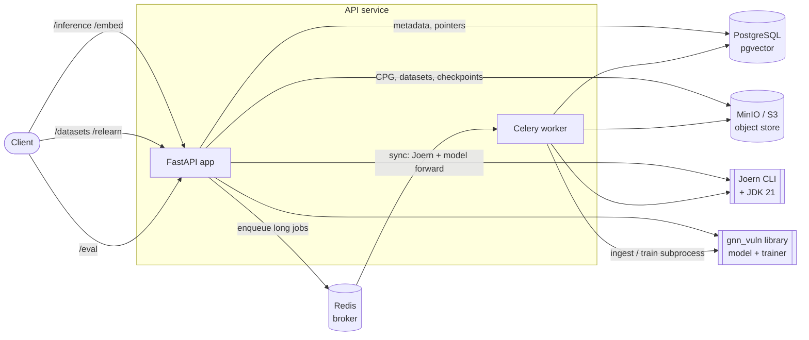
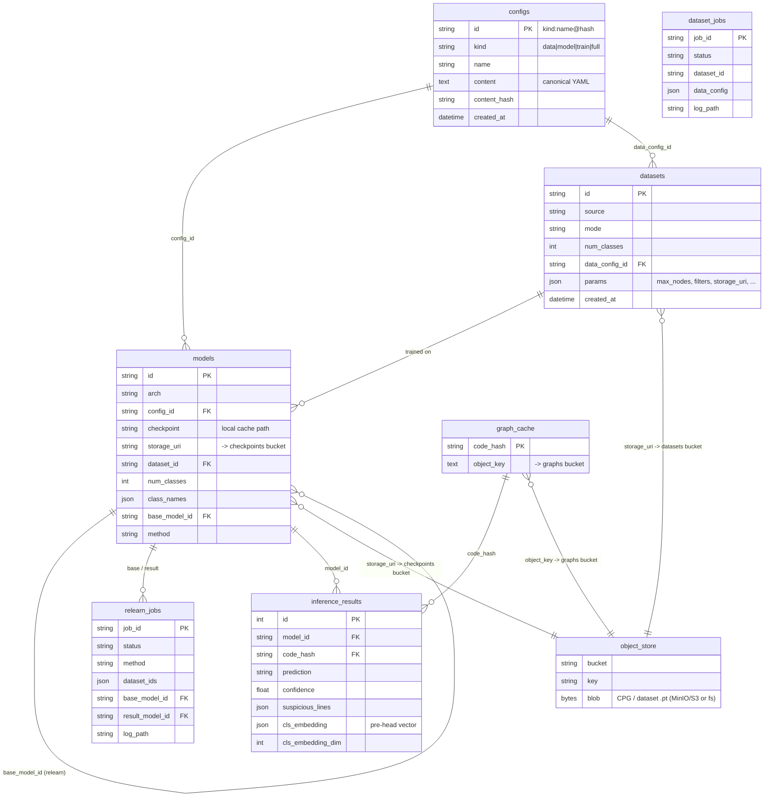

# Vulnerability Detection API

Production FastAPI service over three trained GNN/LM vulnerability-detection models. It
classifies a C/C++/Java function by CWE, localizes the suspicious lines, exposes the
pre-head function embedding, ingests new datasets, retrains continually, and monitors
for drift.

The model code is a separate installable **library** (`gnn_vuln`); this service depends on
it as a package — it never reaches into the model source tree. See
[The `gnn_vuln` library](#the-gnn_vuln-library) below.

> **Full endpoint reference (request/response schemas, examples) lives in
> [`openapi.json`](openapi.json)** — view it at the live docs `http://localhost:8000/docs`,
> or open `openapi.json` with any OpenAPI viewer (e.g. the VS Code OpenAPI extension). This
> README covers architecture and the bits the spec can't: how the pieces fit, the storage
> model, and the library API.

---

## Capabilities

| Endpoint          | What it does                                                                            |
| ----------------- | --------------------------------------------------------------------------------------- |
| `POST /inference` | function source → CWE + confidence + suspicious lines (per-line scores)                 |
| `POST /embed`     | function source → final pre-head embedding (similarity search / drift), no output head  |
| `POST /datasets`  | raw rows → Joern CPG → `.pt`, **or** merge existing `dataset_ids` → new dataset, in object storage |
| `POST /relearn`   | continual-learning job (finetune / EWC / ER / EWC-ER / retrain) → new model             |
| `GET /eval`       | general label-free model eval over stored predictions (usage, mix, confidence + drift)  |
| `GET …`           | `/health` `/models` `/datasets` `/configs` `/inference/history` + job status            |

---

## System architecture



- **FastAPI app** — request/response. Synchronous, fast paths (inference, embed, eval) run
  inline; long jobs (dataset ingestion, relearn training) are **enqueued to Celery** and
  return a job id immediately.
- **Celery worker** — separate process (own GPU) for the heavy work: Joern CPG generation,
  `.pt` building, and the training subprocess. Broker = Redis.
- **PostgreSQL** (pgvector image) — metadata + pointers only (never blobs). pgvector is ready
  for ANN search over the stored embeddings.
- **MinIO/S3** — object storage for the big binaries (CPG blobs, dataset `.pt` bundles, model checkpoints).
- **Joern + JDK 21** — Code Property Graph generation, baked into the image.
- **`gnn_vuln`** — installed library: the 3 model architectures, the CPG→`.pt` pipeline, the
  trainer, and the `VulnPredictor` inference wrapper.

### The three models

All three share the CodeBERT/UniXcoder node featurization + a GNN; they differ in how the
function-level LM is fused. Detail in `docs/bab-3.md`; model ids match those names.

| `model_id`        | Architecture (bab-3)        | arch flag        | LM fusion                            |
| ----------------- | --------------------------- | ---------------- | ------------------------------------ |
| `graph_based`     | Arsitektur Berbasis Graph   | `lmgat_codebert` | GNN-only (frozen LM node features)   |
| `hybrid_graph_lm` | Arsitektur Hibrida Graph–LM | `lmgat_codebert` | GNN ⊕ live function-LM (late fusion) |
| `sequential`      | Arsitektur Sekuensial       | `lmgat_seqgnn`   | localize→classify two-stage GNN      |

### Request flows

- **Inference / Embed** — `code → graph_cache lookup (sha256) → [miss] Joern CPG → node
embed + GNN/LM forward → prediction + pre-head embedding`. The embedding is captured by an
  eval-only forward-pre-hook on the output head and persisted (drift/search); `/inference`
  returns only its dim, `/embed` returns the vector.
- **Ingest** (`POST /datasets` with `rows`, async) — `rows → parquet → gnn_vuln.data.prepare
(Joern CPG + cwe_vocab) → data-build config → gnn_vuln.data.build_pt (.pt) → tar(.pt + vocab)
→ MinIO → register dataset_id (+ immutable data_config_id)`. Poll `GET /datasets/jobs/{id}`.
- **Combining datasets** — three ways: (A) send all rows in one ingest; (B) `POST /datasets`
  with `dataset_ids: [X, Y]` → materialize each `.pt` → `gnn_vuln.data.merge` (concat graphs +
  unify the label space + remap + best-effort dedup) → a NEW reusable `dataset_id`; (C) `POST
  /relearn` with multiple `dataset_ids` → the same `.pt`-level merge inline at train time. All
  three merge at the `.pt` level (no raw CPG, no re-embedding).
- **Relearn** (`POST /relearn`, async) — `materialize task-A+B datasets to local disk →
build merged config → [EWC] importance pass → gnn_vuln.train → register new model`. Poll
  `GET /relearn/{id}`.
- **Eval** (`GET /eval`) — general label-free report over stored predictions: usage count,
  prediction mix, mean confidence, plus a nested drift signal (PSI on class distribution +
  mean-confidence delta + embedding-centroid cosine shift). The drift signal _triggers_ a
  relearn.

---

## Layout

```
API/
  core/        config.py (settings/env), database.py (engine, session, init+seed)
  models/      tables.py — ORM: configs, models, datasets, relearn_jobs, dataset_jobs,
               graph_cache, inference_results
  schemas/     pydantic request/response (inference+embed+drift, relearn, dataset)
  services/    registry, seed, storage (object store), graph_cache,
               inference (predict+embed), relearn (+materialize), datasets, eval (general+drift)
  routers/     meta, inference (+/embed), relearn, datasets, eval (/eval)
  configs/     data_build.yaml — self-contained dataset-build (featurization) config
  seeds/       models.json, datasets.json — DB seed on first boot
  celery_app.py, tasks.py   — Celery app + async tasks (ingest_dataset, merge_datasets, run_relearn)
  main.py      app wiring (lifespan init_db + seed, CORS, routers)
  Dockerfile, docker-compose.yml, docker-compose.gpu.yml, requirements.txt, pyproject.toml
  export_openapi.py → openapi.json
```

---

## Run — dev (Docker, recommended)

The stack (Postgres + Redis + MinIO + API + worker + Adminer) comes up with one command. API
source is bind-mounted, so editing `API/*.py` + `docker compose restart api worker` applies
without a rebuild (only `src/gnn_vuln` changes need `build`, because that goes into the wheel).

```bash
docker compose -f API/docker-compose.yml up -d --build
curl http://localhost:8000/health
```

UIs: API docs `:8000/docs` · MinIO console `:9001` (minioadmin/minioadmin) ·
Adminer `:8080` (server `db`, user/pass/db `vuln`/`vuln`/`vulndb`).

### GPU (mimic prod)

```bash
docker compose -f API/docker-compose.yml -f API/docker-compose.gpu.yml up -d --build
```

The overlay builds the image with CUDA torch (cu124), reserves the host GPU for api + worker,
and sets `API_DEVICE=cuda`. Needs the NVIDIA Container Toolkit (`docker info` shows the
`nvidia` runtime).

### Run the API standalone (its own venv)

The API is its own uv project depending on `gnn-vuln` as a package:

```bash
cd API && uv sync          # builds/installs gnn-vuln from .. + web deps into API/.venv
uv run uvicorn API.main:app --host 0.0.0.0 --port 8000
```

Env: `DATABASE_URL`, `JOERN_CLI`, `GNN_VULN_ROOT` (data/checkpoint root), `API_DEVICE`
(`cpu`|`cuda`), `API_CORS_ORIGINS`, `API_MAX_NODES`, `STORAGE_BACKEND` (`fs`|`s3`) +
`S3_*` + `S3_BUCKET_GRAPHS`/`S3_BUCKET_DATASETS`, `CELERY_BROKER_URL`,
`CELERY_RESULT_BACKEND`.

Checkpoints: edit `API/seeds/models.json` to point the three model ids at real `.pt` files
(mounted under `/app/checkpoints`); models trained via `/relearn` register themselves.

---

## Storage & data model — metadata in the DB, blobs in object storage

Best practice for ML services: keep large binaries **out** of the relational DB (5–20× pricier
per byte for blobs, 1 GB field cap, slow backups). The DB holds metadata + a **pointer**; the
blob lives in object storage.

- **Built CPG graphs** → blob in the `graphs` bucket (key `sha256(code).fmt`); `graph_cache`
  keeps only `code_hash → object_key`. Repeat requests skip Joern. Backend pluggable:
  `STORAGE_BACKEND=fs` (local folder, zero deps) | `s3` (MinIO/S3, same boto3 code).
- **Dataset `.pt` bundles** → `datasets` bucket; `datasets.params.storage_uri` records the
  pointer. Pulled to local disk at relearn time (SageMaker File-Mode pattern, cached by id).
- **Model checkpoints** → `checkpoints` bucket; `models.storage_uri` is the source of truth,
  `models.checkpoint` is the local cache path. A relearned model uploads its `.pt` after
  training; inference materializes it back to disk on demand — so a worker on another node
  can load a model it never trained (the container FS is ephemeral; only the buckets are
  durable + shared). Seed models ship as local files (no `storage_uri`) and load directly.
- **Inference results** (prediction + confidence + suspicious lines + **pre-head embedding**)
  → `inference_results`. The embedding is small + structured, so it stays in the DB (pgvector
  ANN index at search time). Query `GET /inference/history`.

### Immutable, content-addressed versioning

Configs, datasets and models are **append-only — never overwritten**:

- **Configs** → `configs` table, id = `{kind}:{name}@{sha256(content)[:10]}`, where
  `kind ∈ data | model | train | full`. Same content reuses the id (dedup); an edit mints a
  **new** id. `GET /configs?kind=data`. So any reference always resolves to the exact content
  it was trained with — reproducibility without a separate snapshot.
- **Datasets / models** get a fresh id per ingest/run. A dataset links its `data_config_id`
  (kind=data); a relearned model links `config_id` + `base_model_id` + `method`.

Why no graph DB (Neo4j)? We only store/fetch the whole CPG by hash and render client-side — no
server-side traversal — so object storage + Postgres suffice.

### ERD



### Relearn methods

| `method`   | start weights   | EWC penalty | replay buffer       |
| ---------- | --------------- | ----------- | ------------------- |
| `finetune` | base checkpoint | off         | no                  |
| `EWC`      | base checkpoint | weight 1000 | no                  |
| `ER`       | base checkpoint | off         | base-dataset buffer |
| `EWC-ER`   | base checkpoint | weight 1000 | base-dataset buffer |
| `retrain`  | random init     | off         | no                  |

`base_model_id` is required for everything except `retrain` (it supplies the architecture,
start weights, and the task-A dataset for the replay buffer + EWC importance). CIL (task-B adds
new classes) is automatic — `num_classes` grows and the base head loads expandably.

---

## The `gnn_vuln` library

The model code is an installable package (`pip install gnn-vuln`). The service uses only its
public surface — string in, dict out; the Joern CPG step is hidden inside the call:

```python
from gnn_vuln.inference import VulnPredictor

predictor = VulnPredictor.from_checkpoint("checkpoints/<run>/best_model.pt",
                                          "configs/<arch>/config.yaml", device="cuda")
result = predictor.predict_code("void f(char*s){char b[8];strcpy(b,s);}",
                                joern_cli="/opt/joern/joern-cli", top_k_lines=5)
# result: {prediction, confidence, class_probabilities, suspicious_lines, cls_embedding, ...}
```

**Full library reference** (every exported function/class, import paths, inputs, outputs,
result schema, the `python -m` data/training CLIs) → **[`src/gnn_vuln/README.md`](../src/gnn_vuln/README.md)**.
